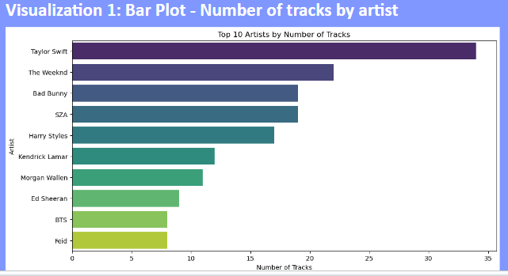
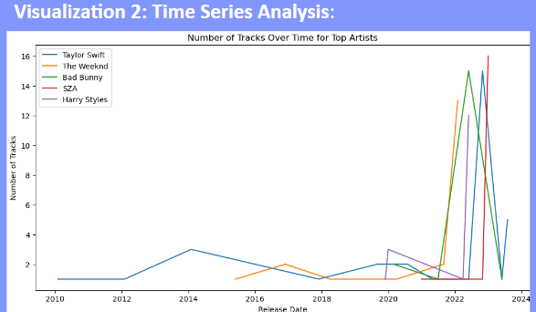
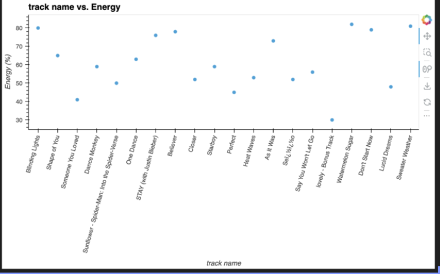
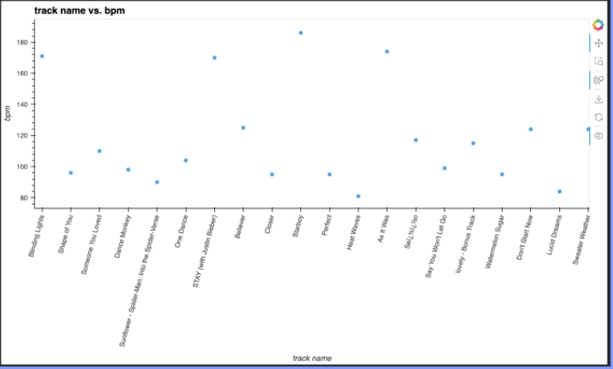
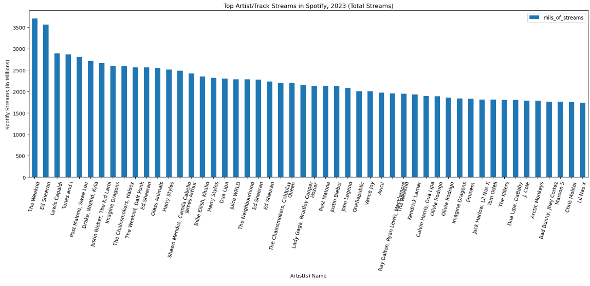
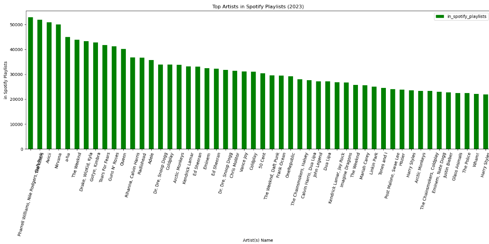
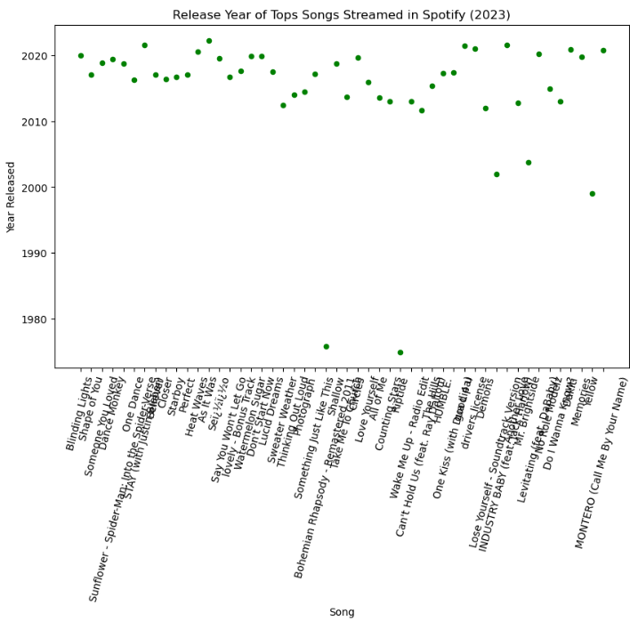
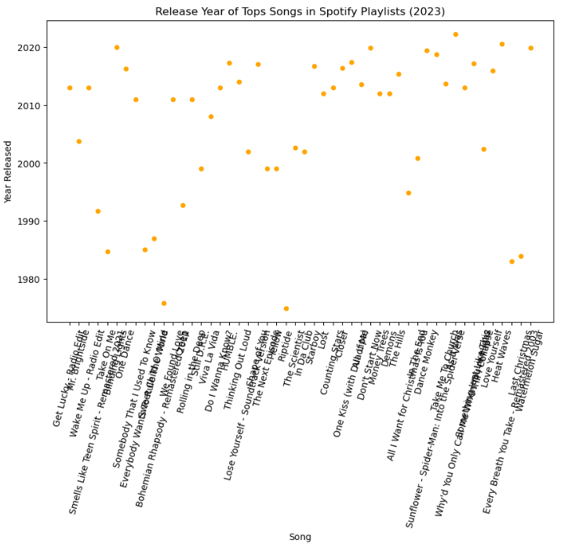
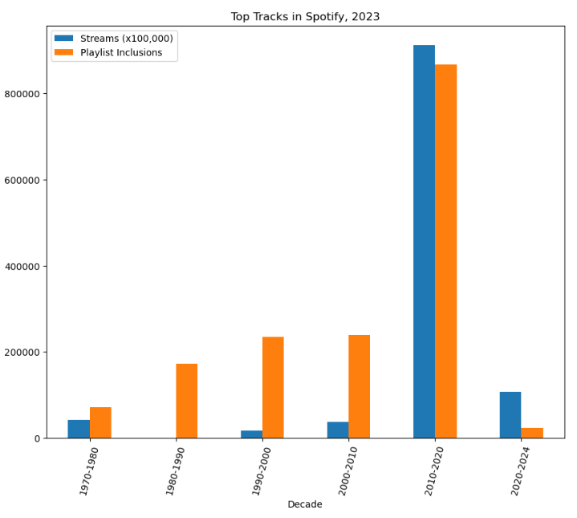

# Spotify 2023

# Project Description:

The goal of this project is to investigate data from Spotify's Most Streamed Music from 2023.  

The final presentation is located here:

[https://docs.google.com/presentation/d/1QTn1QKiOGeViOmNLD9WQJBfPmGdNsJrZb--lwdYSSKo/edit?usp=sharing]()

The data was sourced from Kaggle, "Most Streamed Spotify Songs 2023":

[https://www.kaggle.com/datasets/nelgiriyewithana/top-spotify-songs-2023](),

# Data Description and Features

#### Description:

> This dataset contains a comprehensive list of the most famous songs of 2023 as listed on Spotify. The dataset offers a wealth of features beyond what is typically available in similar datasets. It provides insights into each song's attributes, popularity, and presence on various music platforms. The dataset includes information such as  **track name, artist(s) name, release date, Spotify playlists and charts, streaming statistics, Apple Music presence, Deezer presence, Shazam charts, and various audio features** .

#### Key Features:

> * **track_name** : *Name of the song*
> * **artist(s)_name** : *Name of the artist(s) of the song*
> * **artist_count** : *Number of artists contributing to the song*
> * **released_year** : *Year when the song was released*
> * **released_month** : *Month when the song was released*
> * **released_day** : *Day of the month when the song was released*
> * **in_spotify_playlists** : *Number of Spotify playlists the song is included in*
> * **in_spotify_charts** : *Presence and rank of the song on Spotify charts*
> * **streams** : *Total number of streams on Spotify*
> * **in_apple_playlists** : *Number of Apple Music playlists the song is included in*
> * **in_apple_charts** : *Presence and rank of the song on Apple Music charts*
> * **in_deezer_playlists** : *Number of Deezer playlists the song is included in*
> * **in_deezer_charts** : *Presence and rank of the song on Deezer charts*
> * **in_shazam_charts** : *Presence and rank of the song on Shazam charts*
> * **bpm** : *Beats per minute, a measure of song tempo*
> * **key** : *Key of the song*
> * **mode** : *Mode of the song (major or minor)*
> * **danceability_%** : *Percentage indicating how suitable the song is for dancing*
> * **valence_%** : *Positivity of the song's musical content*
> * **energy_%** : *Perceived energy level of the song*
> * **acousticness_%** : *Amount of acoustic sound in the song*
> * **instrumentalness_%** : *Amount of instrumental content in the song*
> * **liveness_%** : *Presence of live performance elements*
> * **speechiness_%** : *Amount of spoken words in the song*

# Data Import and Preparation

#### Import

Data from the CSV was well organized and mostly ready for use, however it required a few actions upon import:

* Import required encoding as ISO-8859
* To create a single Release datetime64 object, we required combining three columns for year, month and day.

```
df=pd.read_csv(csv_path, encoding='ISO-8859-1', parse_dates= { 'release_date' : ['released_year', 'released_month', 'released_day']})
```

#### Preparation

The data had some some heterogeneous data within some of the columns, so were imported as objects.  They required converstion to numeric and string)

* Convert to numeric / int64: streams, in_deezer_playlists, in_shazam_charts
* Convert to string: track_name, artist(s)_name, mode

*(NOTE: errors='coerce' argument will replace all non-numeric values with NaN.)*

```
str_cols= ['track_name','artist(s)_name','key','mode']
df_clean[str_cols] =df_clean[str_cols].astype('string')
```

```
cols= ['streams','in_deezer_playlists','in_shazam_charts']
df_clean[cols] =df_clean[cols].apply(pd.to_numeric, errors='coerce')
```

The Streams column values were much higher than all the others.  In order to have visualizations scale better, this column was converted into 'Millions of Streams' and renamed:

```
df_mils=df_clean.copy()
df_mils['streams'] =df_mils['streams'].apply(lambdax: round(x/1000000, 4))
df_mils=df_mils.rename(columns={'streams':'mils_of_streams'})
```

# Questions to Investigate:

Utilizing the features from the Data Source, the team prepared some potential areas to investigate.

Features:

```
'release_date', 'track_name', 'artist(s)name', 'artist_count',
       'in_spotify_playlists', 'in_spotify_charts', 'streams',
       'in_apple_playlists', 'in_apple_charts', 'in_deezer_playlists',
       'in_deezer_charts', 'in_shazam_charts', 'bpm', 'key', 'mode',
       'danceability%', 'valence_%', 'energy_%', 'acousticness_%',
       'instrumentalness_%', 'liveness_%', 'speechiness_%']
```

This information was used to analyze trends in music popularity, genre characteristics, and streaming performance across different platforms.
This dataset provided a variety of insights into modern music trends, streaming performance, and musical characteristics. 

Here are some of the topics of interest, derived from this dataset:

**1. Popularity Trends:**
Identify which artists and tracks are most popular by looking at the number of streams and their presence in playlists and charts.
The dataset allows tracking the rise of certain tracks over time by comparing their streams, playlist inclusions, and chart positions.

```
'artist(s)name' 
	'in_spotify_playlists', 'in_spotify_charts', 'streams',
	'in_apple_playlists', 	'in_apple_charts', 
	'in_deezer_playlists',	'in_deezer_charts', 
	'in_shazam_charts
```

**2.  Collaboration and Artist Influence:**
The artist count column highlights tracks with multiple artists, which could indicate collaborations that boost a song's popularity.
Comparing single-artist tracks with collaborations can reveal if collaborations tend to be more successful.

```
'artist_count'
	'in_spotify_playlists', 'in_spotify_charts', 'streams',
	'in_apple_playlists', 	'in_apple_charts',
	'in_deezer_playlists',	'in_deezer_charts',
	'in_shazam_charts
```

**3.  Seasonal Releases:**
By analyzing the released month and release day columns, we can see if there are any trends in the release dates, such as more releases during summer or holiday seasons.

```
['release_date'].month, ['release_date'].day
```

Possible months/days to investigate:  Spring Break (mid-March), Summer (June-August), Holiday Season (Nov-Dec)

**4.  Musical Features:**
The dataset includes audio features like `danceability_%, valence_%, energy_%, acousticness_%, instrumentalness_%, liveness_%, and speechiness_%.`

These features can be analyzed to understand the characteristics of popular songs.

For instance, you can find out if high-energy songs or more acoustic tracks are currently trending.

Investigate: Which characteristics/audio features are present in the most popular songs?

**5.  Platform Popularity:**
The ` in_spotify_playlists`, `in_spotify_charts`, and `in_apple_playlists columns` allow comparison of platform-specific popularity.

This can show whether some tracks perform better on Spotify or Apple Music.

**6.  Release Date Insights:**
The `release_date` column provides exact dates, which can be used to study the impact of release timing on a track's success.

Does there seem to be a time of year that leads to success of a track?

**7.  Genre and Mood Analysis:**
By examining the key and `mode (Major/Minor) columns`, along with `valence_%`, you can infer the general mood of popular music?

For example, you might find that most popular songs are in a major key and have a high valence, indicating a positive mood.

**8.  Artist Dominance:**
The number of times an artist ` artist(s)name` appears in the dataset can show which artists are currently dominating the music scene.

This can be cross-referenced with their chart and playlist presence.
By exploring these aspects, you can uncover valuable insights into what makes a song popular, how musical tastes evolve over time, and the impact of various factors on a track's success.


# Conclusions Drawn:

1. **Artist Popularity by Number of Tracks** (Shubhda)

The bar plot visualizes which artists have the highest number of tracks. This can indicate popularity or prolificacy in producing music within the dataset- Taylor Swift



2. **Time Series Analysis** (Shubhda)

Explore trends over time for these top artists. Are certain artists consistently producing tracks, or is there variation over time Since we dont have enough data from prior year to analyse, this dataset won’t be considered ideal for such comparison.



3. **Genre and Mood Analysis** (Maryam)

Observations of 'BPM (Beat per Minute)' of the Top 50 Tracks show that the most popular tracks tend to range from 90-



Observations of 'Energy' of the Top 50 Tracks show no specific relationship.




4. **Investigation of Most Popular Tracks, as Measured by 'Most Streamed' and  'Most Added/Included in Playlists:'**

Assumption was that "Most Streams" and "Most Added/Included in Playlists" would be similar list of Artists/Tracks.

However, the data showed a different set of Artists for each category.





Upon closer inspection, Top Streamed songs tended to have release dates closer to 2023 (much more recent songs), while Songs added to Playlists had a much broader date/year distribution:






By grouping/binning the Tracks Release Dates by Decade, the result was more conclusive:

Conclusions:  

1. Top Streaming Tracks tend to be recently Released.
2. Playlist Addition tend to Include historical tracks, from a broader Range of Release Dates.




---
