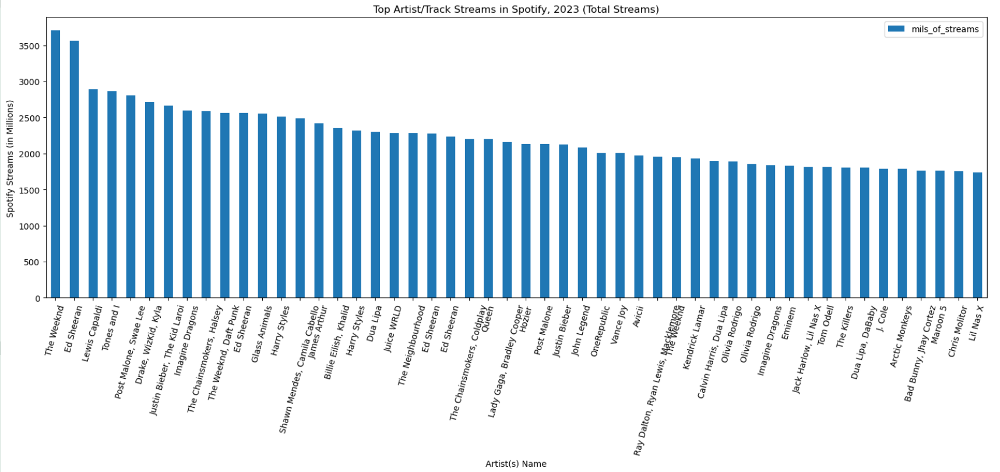
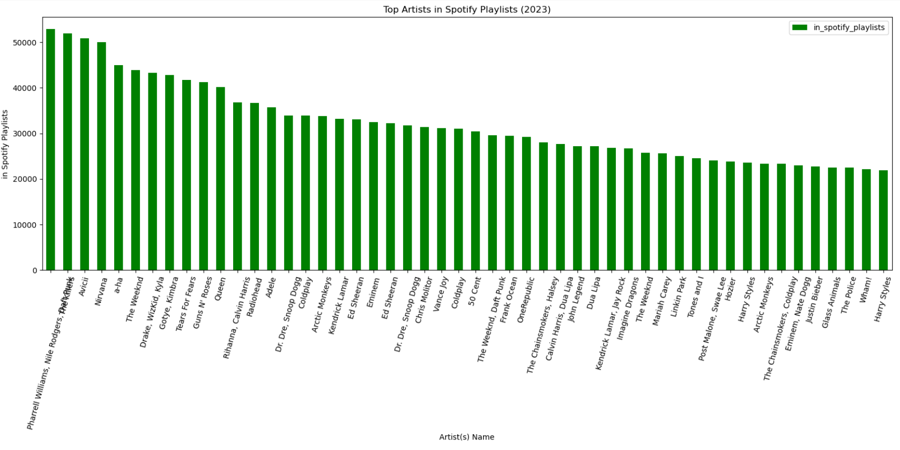
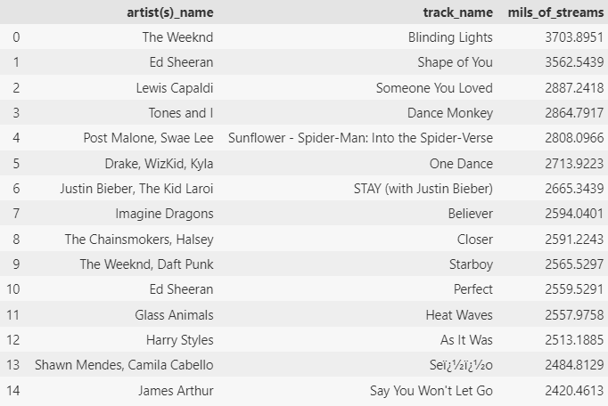
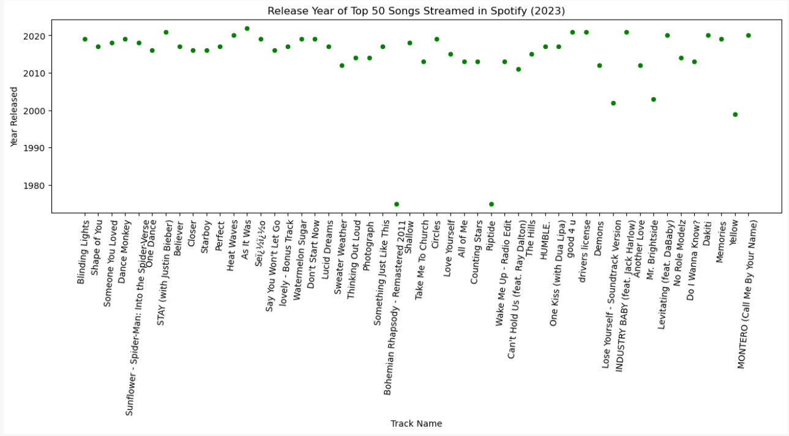
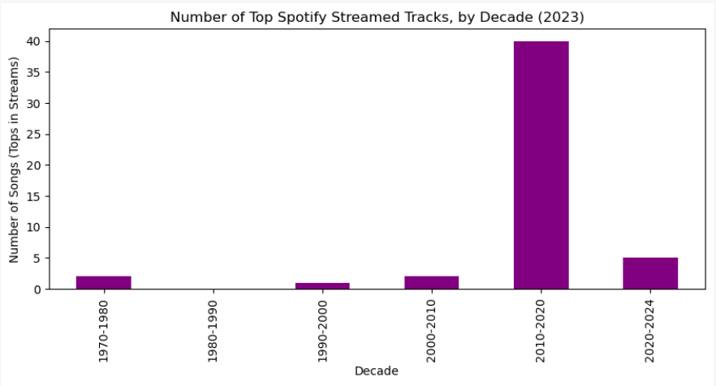
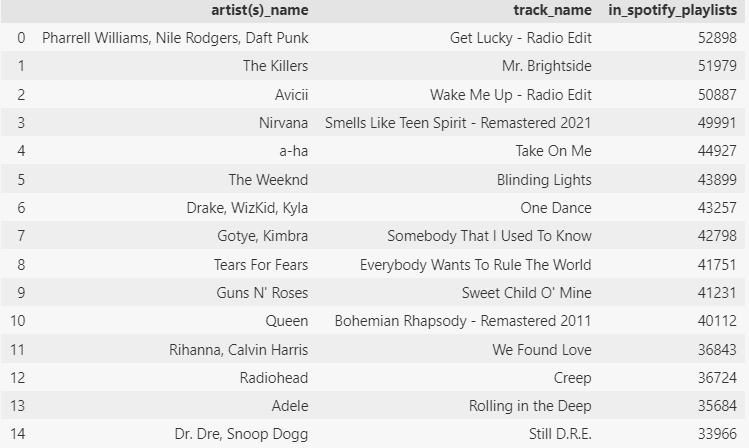
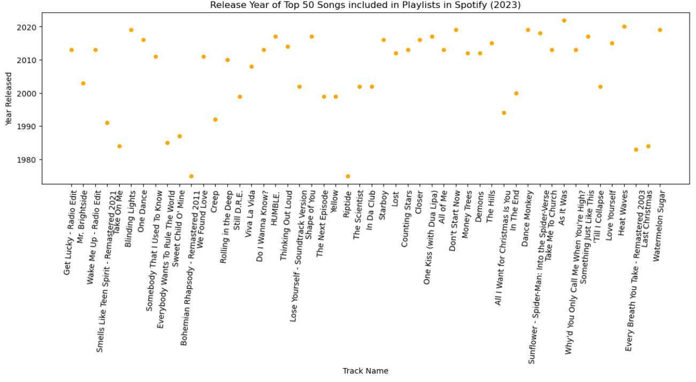
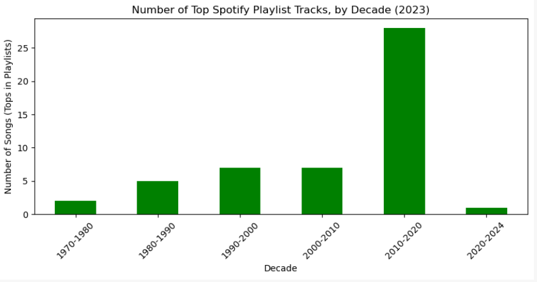
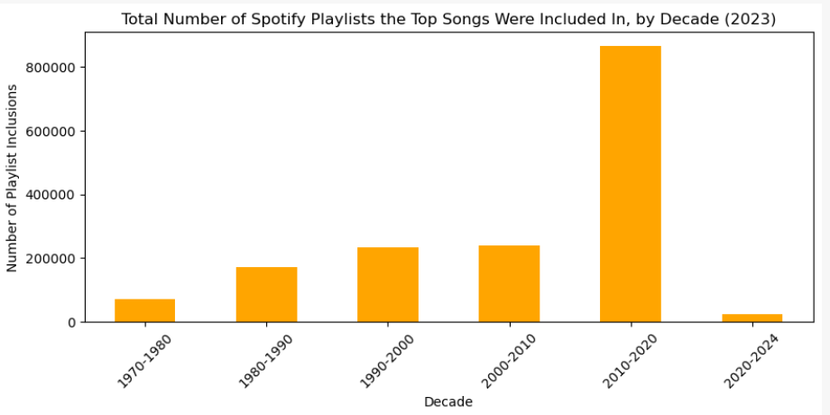

# Spotify Streaming Data Analysis 2023

This project analyzes the most streamed Spotify songs of 2023 to understand trends in streaming, artist popularity, and song characteristics across platforms like Spotify, Apple Music, Deezer, and Shazam.

**[Data](#data)** | **[Top Artist Streams vs. Top Artists in Playlists](#top-artist-streams-vs-top-artists-in-playlists)** | **[Deep Dive into Top Artist Streams vs. Top Artists in Playlists](#deep-dive-into-top-artist-streams-vs-top-artists-in-playlists)** | **[Technologies and Tools](#technologies-and-tools)** | **[Follow-On Studies](#follow-on-studies)**

---

## Abstract

This project focuses on analyzing the top-streamed songs on Spotify in 2023. The analysis includes exploring data patterns and visualizing trends such as streams, artist presence in playlists, and chart rankings.

---

## Data

#### Sourcing

* This dataset contains information about the most streamed Spotify songs in 2023. It includes song attributes, popularity, and presence on various music platforms:
* Data sourced from Kaggle: [https://www.kaggle.com/datasets/nelgiriyewithana/top-spotify-songs-2023]()

```
'release_date', 'track_name', 'artist(s)name', 'artist_count',
       'in_spotify_playlists', 'in_spotify_charts', 'streams',
       'in_apple_playlists', 'in_apple_charts', 'in_deezer_playlists',
       'in_deezer_charts', 'in_shazam_charts', 'bpm', 'key', 'mode',
       'danceability%', 'valence_%', 'energy_%', 'acousticness_%',
       'instrumentalness_%', 'liveness_%', 'speechiness_%']
```

#### Pre-Processing

* Imported CSV file as ISO-8859 to prevent formatting issues; converted multiple date columns into a single DateTime object.
* Some heterogeneous data existed within some columns and were imported as objects, requiring conversion: `streams`, `in_deezer_playlists`, `in_shazam_charts` (to numeric); `track_name`, `artist(s)_name`, `mode` (to string).

---

## Top Artist Streams vs. Top Artists in Playlists

**Investigation of Most Popular Tracks, as Measured by 'Most Streamed' and  'Most Added/Included in Playlists'** revealed unexpected results.

While investigating the most popular tracks, as measured by "Most Streamed" and "Most Added/Included in Playlists", the assumption was that "Most Streams" and "Most Added/Included in Playlists" would include similar lists of Artists/Tracks.  However, the data showed a different set of Artists for each category

**Top Artist Streams (more current, modern Artists)**

<figure>
    <figcaption><em></em></figcaption>
    
</figure>

**Top Artists in Playlists (more inclusion of artists from the 1970s, 1980s, and 1990s)**

<figure>
    <figcaption><em></em></figcaption>
    
</figure>

## Deep Dive into Top Artist Streams vs. Top Artists in Playlists

#### Top Artist Streams

* The top artists streamed included more modern artists, including Post Malone, Billy Eillish, Juice WRLD, The Weeknd, Harry Styles. **(fig 3)**
* These tracks have more current release dates (closer to 2023) **(fig 4)**
* This focus on the most recent decade is much more obvious when the years are binned/grouped by decade, as displayed in **(fig 5)**

**(fig 3)**

<figure>
    <figcaption><em></em></figcaption>
    
</figure>

**(fig 4)**

<figure>
    <figcaption><em></em></figcaption>
    
</figure>

**(fig 5)**

<figure>
    <figcaption><em></em></figcaption>
    
</figure>

#### **Top Artists in Playlists**

* **Top Artists in Playlists** had much broader release date/year distribution, including more historically popular tracks.
* This category includes older 1970, 1980, 1990s Artists/Tracks, like Queen, Radiohead, Dr. Dre/Snoop Dogg, The Police, Tears for Fears, Guns N' Roses, a-ha, Wham **(fig 6)**
* These tracks have a much broader distribution of release dates, dating back to the 1970s **(fig 7)**
* This distribution is much more obvious when the years are binned/grouped by decade, as displayed with:
  * Number of these tracks include in playlists **(fig 8)** -and-
  * Total number of playlists these tracks were included in **(fig 9)**

**(fig 6)**

<figure>
    <figcaption><em></em></figcaption>
    
</figure>

**(fig 7)**

<figure>
    <figcaption><em></em></figcaption>
    
</figure>

**(fig 8)**

<figure>
    <figcaption><em></em></figcaption>
    
</figure>

**(fig 9)**

<figure>
    <figcaption><em></em></figcaption>
    
</figure>

---

## Technologies and Tools

* **Visualizations** : Generated bar plots using **matplotlib** and **seaborn** to explodata distribution and relationships.
* **Tools and Libraries** : Python, pandas, and Jupyter Notebook were used for data cleaning, analysis, and visualization.

---

## Follow-On Studies

* Apply machine learning models to predict song popularity based on features like tempo, valence, and danceability.
* Explore other platforms like YouTube or Tidal to understand cross-platform trends.

---
